# Global Accelerator Setup Guide

## Overview

This guide provides step-by-step instructions for setting up three EC2 instances running Wordpress. Among these instances, one will have Global Accelerator enabled, while another will utilize CloudFront without caching. By comparing the network and website performance of these three instances, you can gain insights into their respective differences.

## Instructions

### Stage 0 - Selecting a Region

To facilitate a clear comparison, choose a region for deploying the instances that is relatively far away from your location. For instance, if you are in Lagos, Nigeria, consider selecting a US region, and vice versa. This approach ensures that the results are not skewed by the shorter routes and fewer hops (routers) to the instances in the closest region.

For the purpose of this guide, we will be using the **ca-central-1** region. Consequently, all links provided will direct you to resources in that region.

### Stage 1 - Creating the Instances

1. Navigate to the EC2 dashboard by visiting [https://ca-central-1.console.aws.amazon.com/ec2/home?region=ca-central-1#Instances:v](https://ca-central-1.console.aws.amazon.com/ec2/home?region=ca-central-1#Instances:v).

2. Click on the "Launch instances" button.

3. In the "Name" field, enter "wordpress" (you will have the opportunity to change this later).

4. Set the "Number of instances" to 3.

5. Under "Application and OS Images (Amazon Machine Image)," enter "Wordpress" and press <kbd>Enter</kbd>.

6. A pop-up window will appear, displaying various "Wordpress" images available on the AWS Marketplace. For this demonstration, it is recommended to use the same image as follows:

   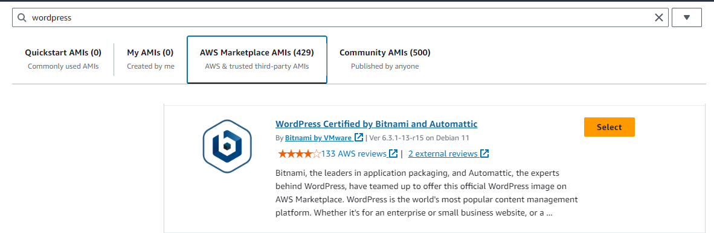

7. Within the pop-up window, click on the "Pricing" tab and ensure that it displays "$0/Hour" next to the product name. Then, click <kbd>Continue</kbd>.

   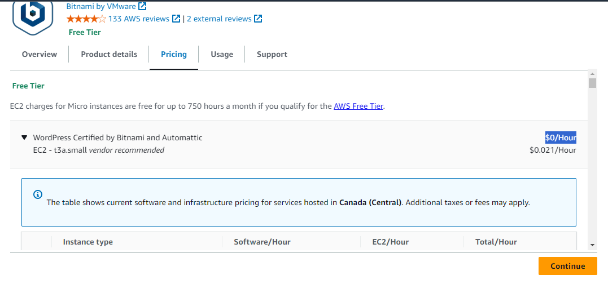

   **Note:** As this is a "marketplace AMI," you may receive emails indicating that you have "subscribed" to a Marketplace Product or received new offers. Do not be concerned as long as the price remains $0/Hour. Additionally, we will cancel the subscription at the end of this guide.

8. Return to the EC2 configuration window. Under "Instance type," select `t2.micro`, which should be eligible for the Free Tier. If your account is less than 12 months old, you are entitled to 750 hours per month of free EC2 compute for specific instance types, including `t2.micro`. Thus, running these instances for a few hours or days should not incur any costs.

   Visit [https://aws.amazon.com/free/?all-free-tier.sort-by=item.additionalFields.SortRank&all-free-tier.sort-order=asc&awsf.Free Tier Types=tier%2312monthsfree&awsf.Free Tier Categories=categories%23compute](https://aws.amazon.com/free/?all-free-tier.sort-by=item.additionalFields.SortRank&all-free-tier.sort-order=asc&awsf.Free%20Tier%20Types=tier%2312monthsfree&awsf.Free%20Tier%20Categories=categories%23compute) for more information on the AWS Free Tier.

   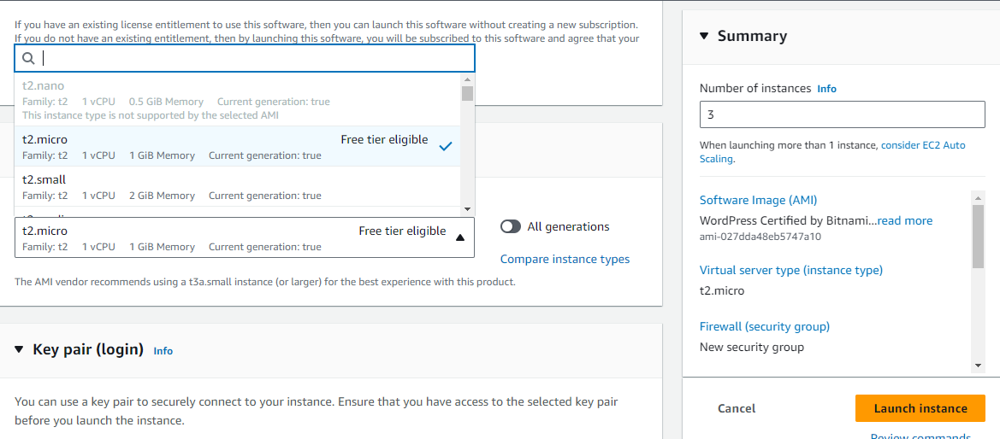

9. Under "Key pair (login)," select "Proceed without a key pair" from the dropdown menu. We will not need to access these instances directly.

   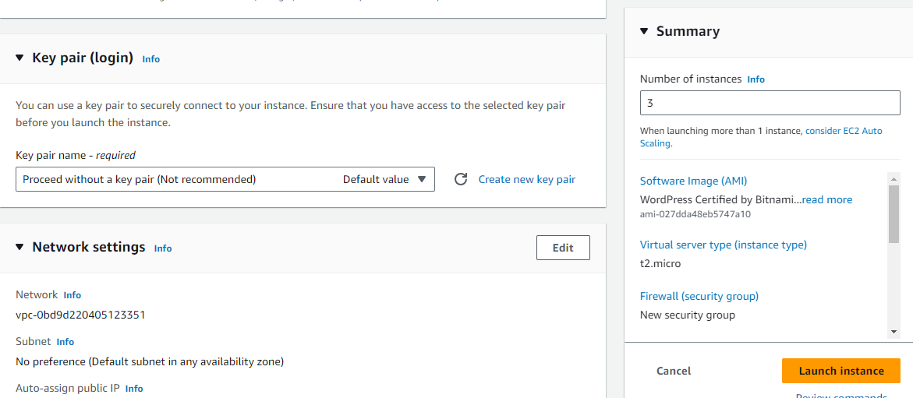

10. For "Network settings," choose the default VPC and select any subnet.

 It is important to select a specific subnet instead of leaving it on "No preference." If EC2 assigns the three instances to different subnets and availability zones, it could slightly impact our testing.

   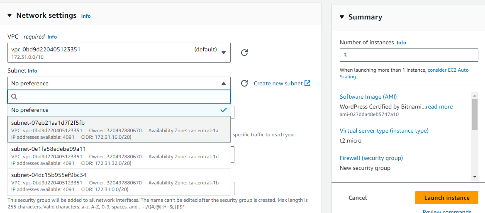

11. Leave "Auto-assign public IP" enabled.

12. Under "Firewall (security groups)," ensure that "Create security group" is selected and that the default "Security group name" is displayed. However, we only require TCP port 80 and ICMP for our testing purposes, so remove any other rules such as SSH and HTTPS.

   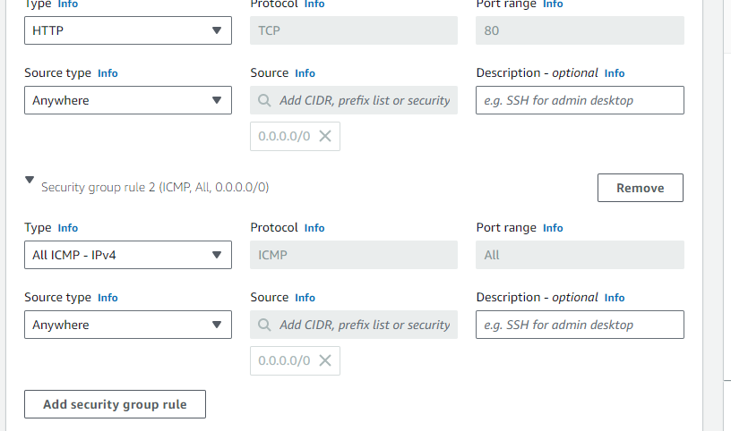

13. Keep the default settings for "Configure storage" and "Advanced details." Then, click <kbd>Launch instance</kbd>.

14. Returning to the EC2 console, you should now see three instances named "wordpress" with assigned Elastic IPs (public IP addresses), all within the same Availability Zone.

   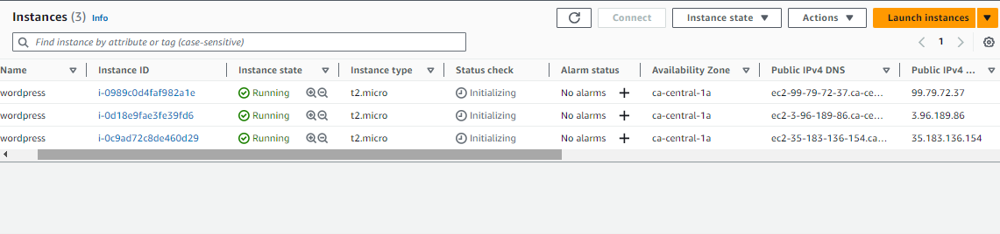

15. Rename each instance as follows (the order does not matter):

   - wordpress - standard
   - wordpress - global accelerator
   - wordpress - cloudfront

   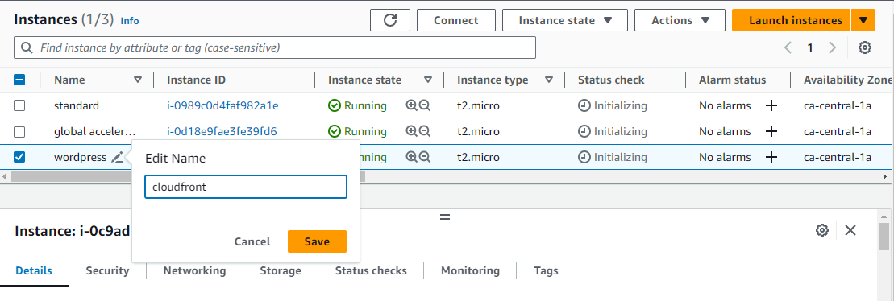

16. Accessing any of the three public IP addresses associated with these instances should display a basic Wordpress page.

   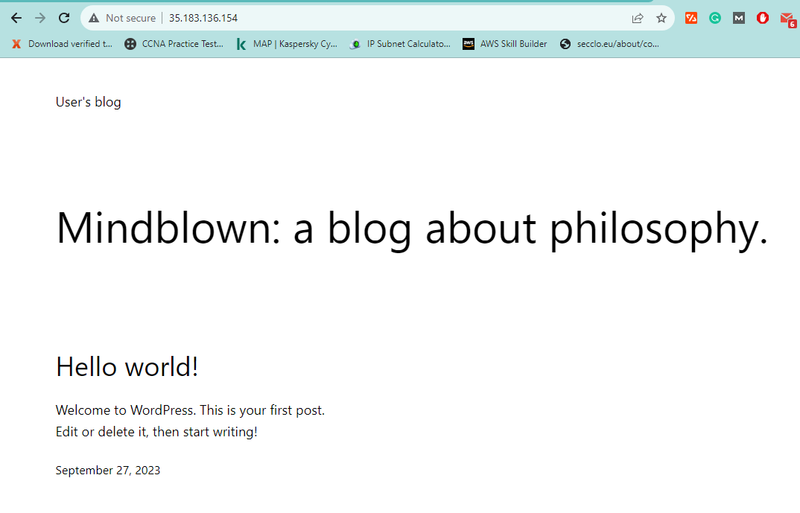
   
   ## Stage 2 - Adding Global Accelerator

To incorporate Global Accelerator into your project, follow these steps:

1. Navigate to the Global Accelerator console by clicking on the following link: [https://us-west-2.console.aws.amazon.com/globalaccelerator/home?region=ca-central-1#GlobalAcceleratorHome:](https://us-west-2.console.aws.amazon.com/globalaccelerator/home?region=ca-central-1#GlobalAcceleratorHome:)

2. Click on the "Create accelerator" button.

3. Provide the desired name for the accelerator, such as "wordpress".

4. Keep the remaining settings as default and proceed by clicking "Next".

5. Under the "Listeners" section, add a new listener for port 80, using the TCP protocol, and set the client affinity to "none". Note that if multiple destinations were present, the client affinity would be set to "Source IP". However, in this demo, there are no alternative destinations for client routing.

6. Click "Next".

7. On the next page, select the appropriate region for your EC2 instances. For instance, if your instances are located in the ca-central-1 region, choose that region.

8. Proceed to the next step by clicking "Next".

9. On the following page, select the "Add endpoint" option.

10. Set the endpoint type as "EC2 Instance" and specify the "wordpress - global accelerator" instance created earlier as the endpoint. Keep the weight setting unchanged.

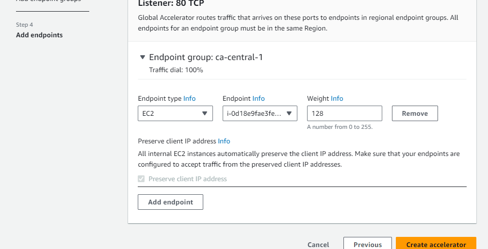

11. Click on "Create accelerator".

12. The creation of the Global Accelerator may take a few minutes (approximately 5-10 minutes based on experience).

13. Once the creation process is complete, you will receive two IPv4 addresses and a DNS name as outputs.

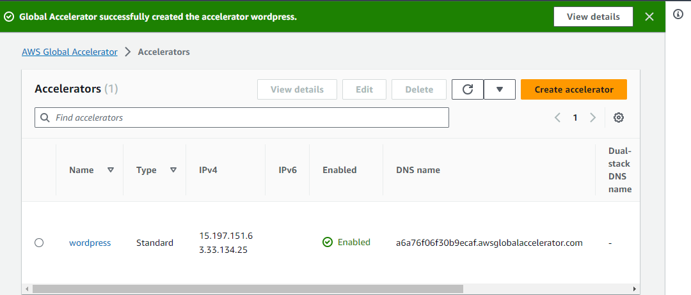

## Stage 2 - Adding CloudFront

To integrate CloudFront into your project, follow these steps:

1. Go to the CloudFront console by clicking on the following link: [https://us-east-1.console.aws.amazon.com/cloudfront/v3/home?region=ca-central-1#/distributions](https://us-east-1.console.aws.amazon.com/cloudfront/v3/home?region=ca-central-1#/distributions)

2. Click on the "Create distribution" button.

3. Set the "Origin" field to the Public IPv4 DNS provided for your "cloudfront" EC2 instance.

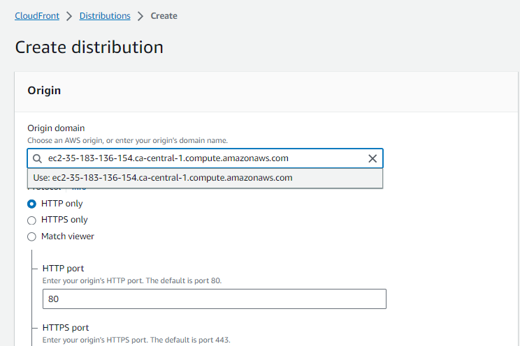

4. Keep the "Protocol" setting as "HTTP only".

5. Under the "Default cache behavior" section, change the setting for "Compress objects automatically" to "No", and select "CachingDisabled" as the cache policy.

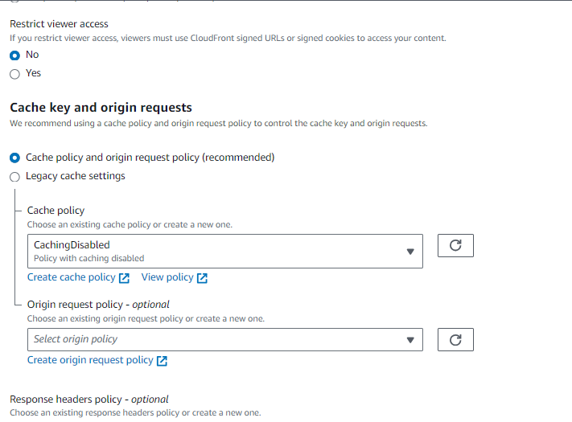

6. Set the "Origin request policy" to "AllViewer".

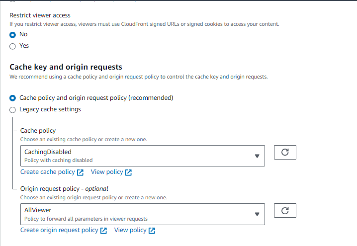

7. Leave all other settings as default and finalize the configuration by clicking on "Create distribution".

## Stage 3 - Testing

This stage focuses on testing the implementation by visiting the three DNS names and observing the WordPress home page for each.

**Wordpress - Standard**

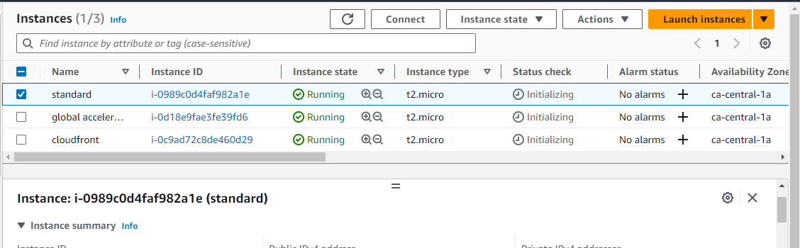

**Wordpress - Global Accelerator**

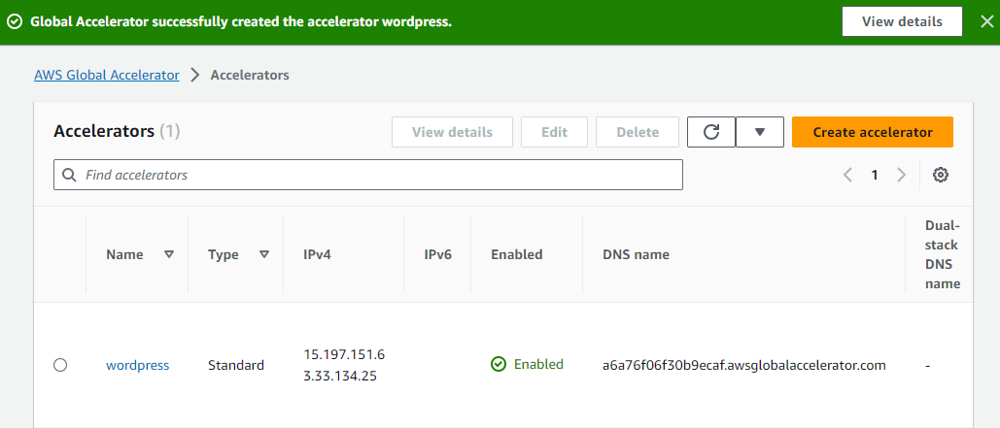

**Wordpress - Cloudfront**

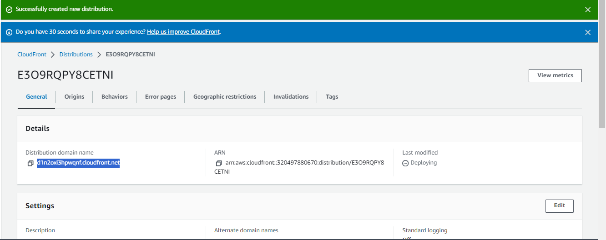

### Network tests

To analyze the network performance, a traceroute is conducted for each DNS record. Please note that the output below shows intentionally obfuscated data for the 3rd hop. Your traceroute results may vary.

**Note**: The following traceroute command was executed on a local machine Linux PC, which uses UDP as the default protocol for traceroutes. For Windows computers, ICMP is used by default, so the command `tracert 99.79.72.37` will yield similar results.

**Wordpress - Standard**

```bash
sudo traceroute -I -q1 ec2-99-79-72-37.ca-central-1.compute.amazonaws.com
traceroute to ec2-99-79-72-37.ca-central-1.compute.amazonaws.com (99.79.72.37), 30 hops max, 60 byte packets
 1  _gateway (10.0.2.2)  0.574 ms
 2  192.168.161.46 (192.168.161.46)  2.802 ms
 3  *
 4  10.238.13.172 (10.238.13.172)  123.388 ms
 5  10.238.98.18 (10.238.98.18)  137.735 ms
 6  *
 7  *
 8  41.203.85.241 (41.203.85.241)  164.297 ms
 9  89.221.43.161 (89.221.43.161)  259.258 ms
10  89.221.43.160 (89.221.43.160)  266.750 ms
11  ae28.ashburn1.ash.seabone.net (195.22.195.35)  356.985 ms
12  amazon.ashburn1.ash.seabone.net (195.22.206.61)  360.302 ms
13  *
14  *
15  *
16  *
17  *
18  *
19  52.94.81.120 (52.94.81.120)  484.914 ms
20  52.94.83.75 (52.94.83.75)  528.945 ms
21  *
22  52.94.81.181 (52.94.81.181)  433.464 ms
23  52.94.81.12 (52.94.81.12)  433.093 ms
24  *
25  *
26  *
27  *
28  *
29  *
30  ec2-99-79-72-37.ca-central-1.compute.amazonaws.com (99.79.72.37)  558.932 ms
```

The traceroute results show 30 hops (routers) and a latency of 558ms to reach the EC2 instance. This latency is expected when routing from Lagos, Nigeria, to Montreal, Canada.

**Wordpress - Global Accelerator**

```bash
$ sudo traceroute -I -q1 a6a76f06f30b9ecaf.awsglobalaccelerator.com
traceroute to a6a76f06f30b9ecaf.awsglobalaccelerator.com (3.33.134.25), 30 hops max, 60 byte packets
 1  _gateway (10.0.2.2)  0.656 ms
 2  192.168.161.46 (192.168.161.46)  2.880 ms
 3  *
 4  10.238.13.180 (10.238.13.180)  121.804 ms
 5  10.238.98.18 (10.238.98.18)  137.944 ms
 6  10.238.98.20 (10.238.98.20)  148.755 ms
 7  *
 8  41.203.85.241 (41.203.85.241)  553.449 ms
 9  151.148.9.17 (151.148.9.17)  552.843 ms
10  *
11  *
12  52.93.93.32 (52.93.93.32)  549.167 ms
13  a6a76f06f30b9ecaf.awsglobalaccelerator.com (3.33.134.25)  548.831 ms

```

For the Global Accelerator, the traceroute reveals only 13 hops and a latency of 548ms.


**Wordpress - Cloudfront**

```bash
sudo traceroute -I -q1 d1n2oxi3hpwqnf.cloudfront.net
traceroute to d1n2oxi3hpwqnf.cloudfront.net (108.157.79.100), 30 hops max, 60 byte packets
 1  _gateway (10.0.2.2)  19.027 ms
 2  192.168.161.46 (192.168.161.46)  18.445 ms
 3  *
 4  10.238.13.172 (10.238.13.172)  51.690 ms
 5  10.238.98.18 (10.238.98.18)  64.002 ms
 6  *
 7  *
 8  41.203.85.241 (41.203.85.241)  85.601 ms
 9  151.148.9.17 (151.148.9.17)  80.777 ms
10  *
11  *
12  *
13  *
14  15.230.9.12 (15.230.9.12)  107.108 ms
15  server-108-157-79-100.los50.r.cloudfront.net (108.157.79.100)  106.738 ms
```

The Cloudfront traceroute shows a similar behavior to Global Accelerator. It also utilizes AWS's internal network to reach the Origin, which in this case is the instance in Canada. The initial connection time is 106ms.

It's worth noting that the main benefit of Cloudfront, caching, is not utilized in this case, which would significantly speed up the page load time and, in many cases, prevent any connections to the Origin instance.

### HTTP Tests

Now let's proceed to test the main use case of Global Accelerator, which is improving application performance. In our case, we will be testing the speed of a Wordpress website, although the same principles apply to any application or service.

1.	To conduct the test, we will use Google Chrome. Please open an Incognito window to avoid any caching affecting the results. Then, press <kbd>F12</kbd> to open the Console and dock it to the bottom of the screen.

	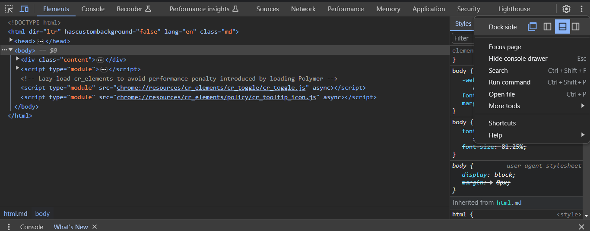

2.	Next, navigate to the Network tab and ensure that "Disable Cache" is checked.

	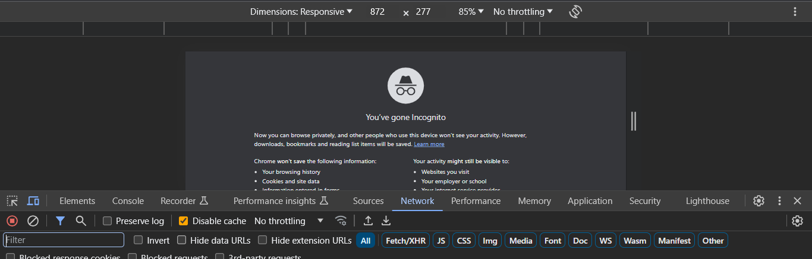

3.	Enter the URL in the address bar and press <kbd>Enter</kbd>. You will see all the requests made to the web server, including their duration, response status, and, most importantly, the waterfall. Hover your mouse over the waterfall to view more details.

	**Note:** For these tests, make sure to use `http` instead of `https`. The EC2 instance is not configured to serve or allow `https` connections, and we want to avoid any impact from SSL configuration on our testing.

4.	**Wordpress - Standard**

	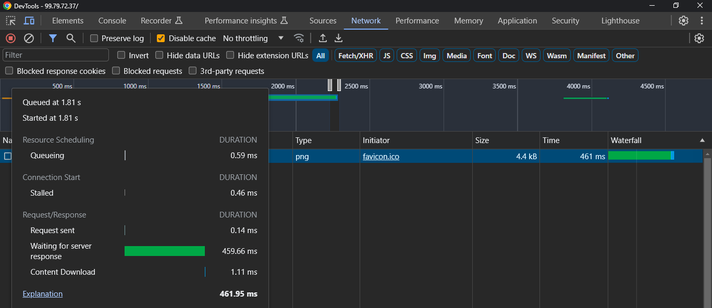

	The standard EC2 instance took 459ms for the server respond.

5.	**Wordpress - Global Accelerator**

	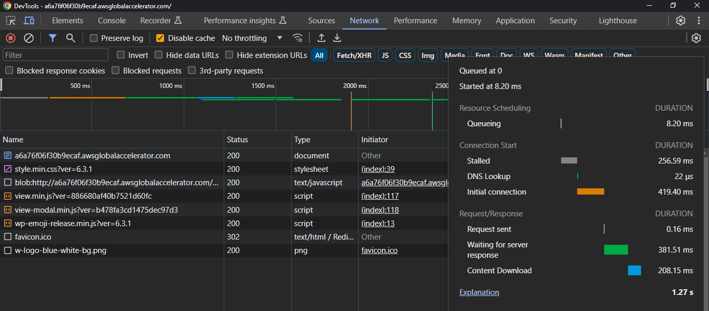

	The difference here is that the initial connection took only 419ms while the server response is 381ms. 

7.	**Wordpress - Cloudfront**

	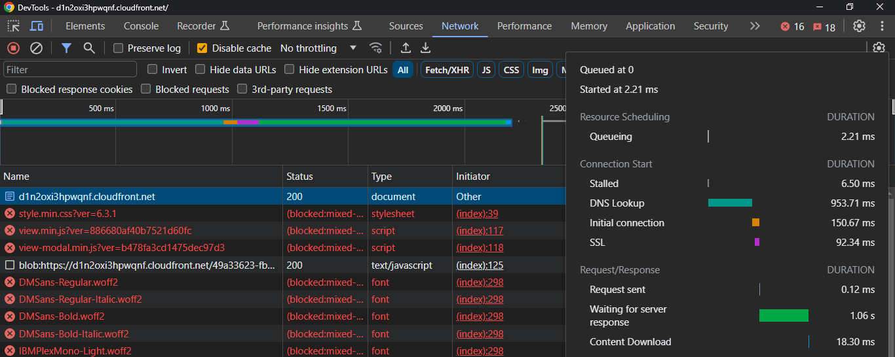

	The initial connection took only 150ms while the server response is 1s.

	The total page load time was faster than the standard instance, thanks to Cloudfront's caching capabilities. However, keep in mind that caching only applies to subsequent requests. The first request will still require contacting the Origin server.

### Conclusion

In this experiment, we explored three different approaches to improve the performance of a WordPress website hosted on an EC2 instance in Canada:

1. **Standard**: This is the baseline configuration without any additional optimizations. The website was directly accessible using the EC2 DNS name.

2. **Global Accelerator**: We used AWS Global Accelerator to route traffic through the AWS network backbone, improving connection times. The website was accessible using a Global Accelerator DNS name.

3. **Cloudfront**: We used Amazon Cloudfront as a content delivery network (CDN) to cache and serve static content from edge locations worldwide. The website was accessible using a Cloudfront DNS name.

Testing the network performance and page load times, we observed the following:

- Global Accelerator significantly reduced the initial connection time, resulting in faster loading times for websites that make multiple smaller connections.
- Cloudfront provided faster overall page load times due to caching and serving content from edge locations.

Ultimately, the choice between Global Accelerator and Cloudfront depends on the specific requirements and characteristics of your application. Global Accelerator is ideal for applications that require fast connection times, while Cloudfront is well-suited for content caching and distribution.

## Stage 4 - Clean up

To proceed with the clean-up process, follow the steps below:

1. Access the Cloudfront console by visiting [https://us-east-1.console.aws.amazon.com/cloudfront/v3/home?region=ca-central-1#/distributions](https://us-east-1.console.aws.amazon.com/cloudfront/v3/home?region=ca-central-1#/distributions).

2. Locate and select the distribution that you have created, then click on the "Disable" button.

   Please note that distributions must be disabled before they can be deleted. Disabling may take a minute or two.

   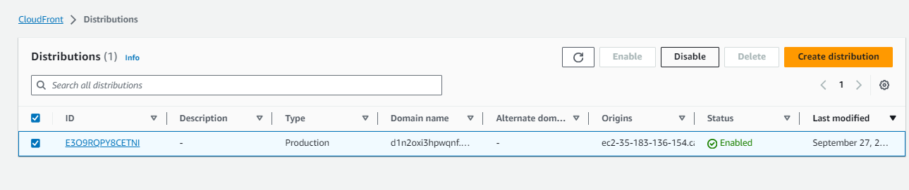

3. Once the disabling process is complete (indicated by the clickable "Delete" button), select your distribution again and click on "Delete".

   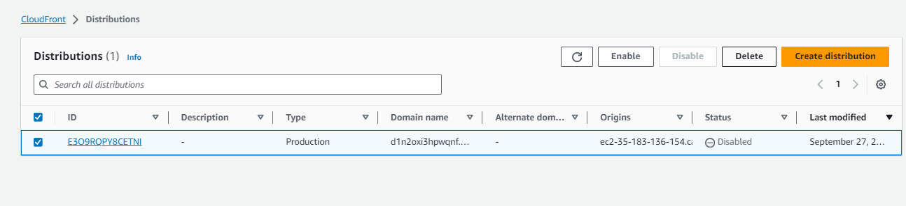

4. Proceed to the Global Accelerator console by visiting [https://us-west-2.console.aws.amazon.com/globalaccelerator/home?region=ca-central-1#GlobalAcceleratorDashboard:](https://us-west-2.console.aws.amazon.com/globalaccelerator/home?region=ca-central-1#GlobalAcceleratorDashboard:).

5. Select the Accelerator you have created and then "Delete".

   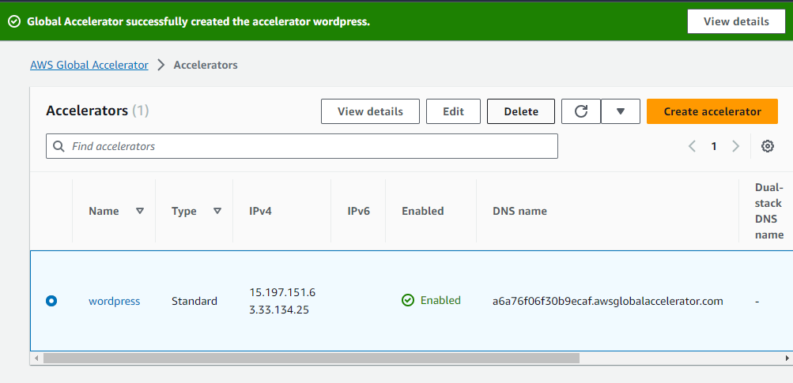

6. In the confirmation box, ensure that you disable the accelerator before proceeding with the deletion.

7. Once the accelerator is disabled, enter the word "delete" in the confirmation box and click on "Delete".

8. Next, navigate to the EC2 instances console by visiting [https://ca-central-1.console.aws.amazon.com/ec2/home?region=ca-central-1#Instances:instanceState=running](https://ca-central-1.console.aws.amazon.com/ec2/home?region=ca-central-1#Instances:instanceState=running).

9. Select the three EC2 instances that you have created and click on "Actions" → "Terminate instance".

   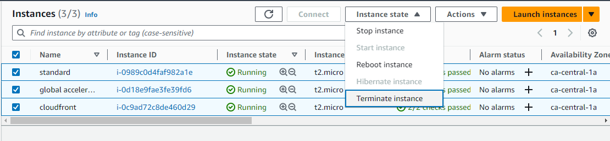

10. Confirm the termination by clicking on "Terminate" in the confirmation popup.

11. Proceed to the AWS Marketplace Subscriptions console by visiting [https://us-east-1.console.aws.amazon.com/marketplace/home?region=ca-central-1#/subscriptions](https://us-east-1.console.aws.amazon.com/marketplace/home?region=ca-central-1#/subscriptions).

    Note that this subscription is free, but for the sake of cleanliness, we recommend removing it as well.

12. Locate your WordPress subscription and click on "Manage".

    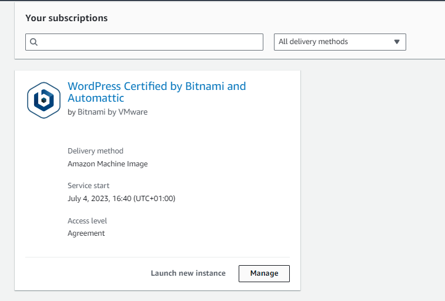

13. Click on "Actions" → "Cancel subscription".

    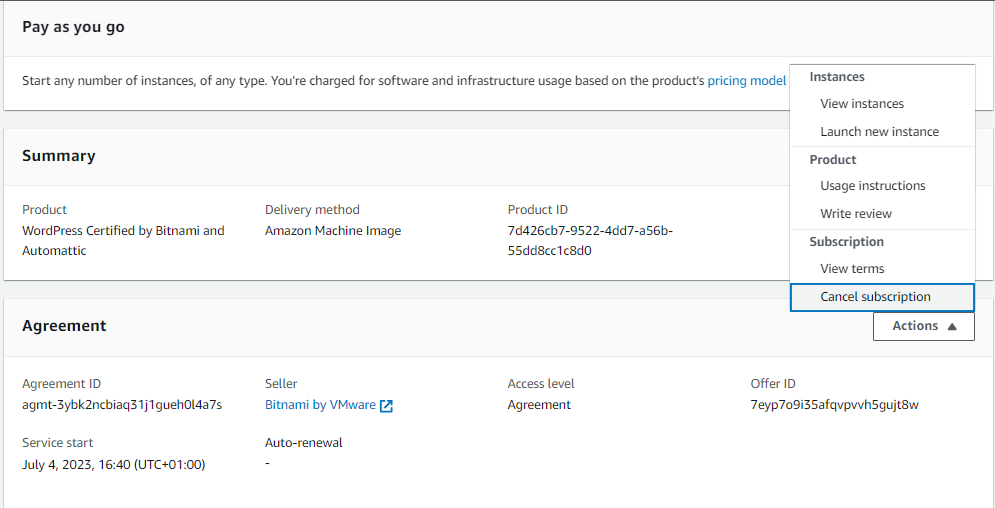

14. To proceed with the cancellation, check the "I understand..." checkbox and click on "Yes, cancel subscription".